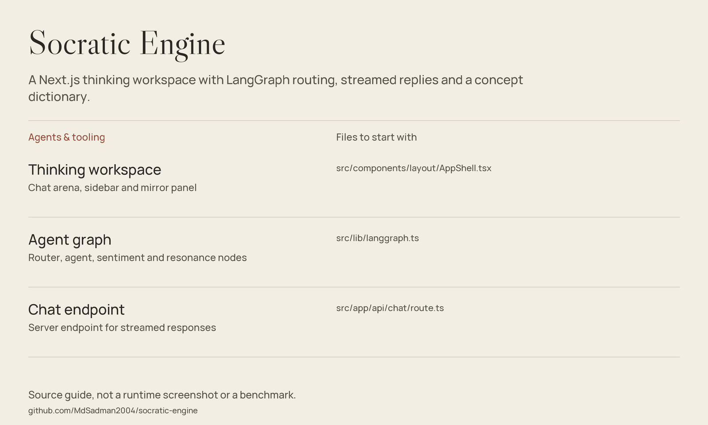

# Socratic Engine

A Next.js thinking workspace with LangGraph routing, streamed replies and a concept dictionary.



*Source guide drawn from the files in this repository; not a runtime screenshot or a fresh benchmark.*

[Getting started](#getting-started) · [Source guide](#source-guide) · [Scope & limitations](#scope--limitations)

## The workspace

Socratic Engine is a research-oriented conversation interface. The agent graph routes between prototyping, interrogation, synthesis and visualization prompts; the interface shows response tracks and a concept dictionary alongside chat.

[Graph implementation](src/lib/langgraph.ts) · [prompt collection](src/lib/prompts) · [session store](src/stores/sessionStore.ts).

## Getting started

Use Node.js compatible with Next.js 16 (20.9+; a current supported LTS release is preferable):

```bash
git clone https://github.com/MdSadman2004/socratic-engine.git
cd socratic-engine
npm install
```

Set `CEREBRAS_API_KEY` in an untracked `.env.local` file or your server environment, then:

```bash
npm run dev
```

Open `http://localhost:3000`. `npm run build` and `npm start` provide the production-build path; `npm run lint` runs ESLint.

The configured model is defined in [src/lib/cerebras.ts](src/lib/cerebras.ts). Model availability and account access must be checked with the provider; never commit an API key.

## Source guide

| Component | File | Purpose |
| :-- | :-- | :-- |
| Thinking workspace | [src/components/layout/AppShell.tsx](src/components/layout/AppShell.tsx) | Chat arena, sidebar and mirror panel |
| Agent graph | [src/lib/langgraph.ts](src/lib/langgraph.ts) | Router, agent, sentiment and resonance nodes |
| Chat endpoint | [src/app/api/chat/route.ts](src/app/api/chat/route.ts) | Server endpoint for streamed responses |

## Scope & limitations

Inference uses the external Cerebras API; the complete experience is not offline. The dictionary, sentiment labels and generated replies are model outputs, not independently verified research conclusions. Token usage includes estimates. The committed Python API test is separate from npm scripts and may need additional setup.

## Reuse & attribution

No standalone repository-wide license file is included in this checkout. Public source access is not a blanket license grant; check provenance and permissions before redistribution.
